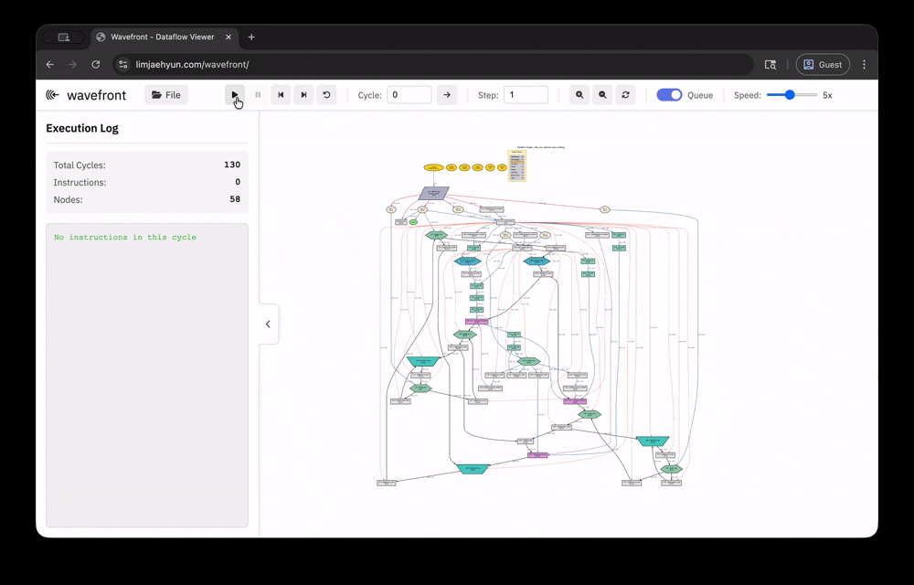

     

# wavefront

Wavefront is a web-based dataflow visualizer. It can generate cycle-by-cycle previews of tokens flowing through a dataflow graph and instructions firing. 

     

## Usage

Prepare a .dot graph file of your dataflow graph and a fire.log file, both generated by dfinfra.

**Live Demo:** [https://jobitaki.github.io/wavefront/](https://jobitaki.github.io/wavefront/)

Or, to use locally, open index.html in your browser. Example dot graph and fire.log are available in the examples directory.