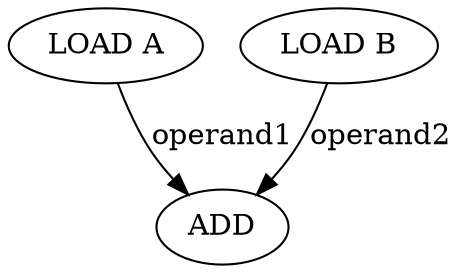

# Tidepool - Dataflow Architecture Debugger

A web-based dataflow debugging interface for visualizing instruction execution and token flow through dataflow graphs.

## Features

- 📊 **DOT File Visualization**: Renders DOT files as interactive dataflow graphs
- 🔄 **Token Flow Animation**: Visualizes data flow through graph edges during execution
- 📝 **Fire Log Parser**: Parses execution trace files showing cycle time, instruction IDs, and outputs
- ▶️ **Playback Controls**: Step through execution or play continuously with adjustable speed
- 🎯 **Real-time Highlighting**: Active instructions and data flows are highlighted during playback

## Architecture

- **Nodes**: Each node represents an instruction in the dataflow graph
- **Edges**: Each edge represents a dataflow dependence between instructions
- **Fire Log**: Execution trace file format: `<cycle> <instruction_id> <output1> <output2> ...`

## Getting Started

### Quick Start

1. Open `index.html` in a web browser (no build step required!)
2. Load a DOT file containing your dataflow graph
3. Load a fire.log file with execution traces
4. Use playback controls to visualize execution

### File Formats

#### DOT File Format
Standard Graphviz DOT format representing the dataflow graph:


#### Fire Log Format
Each line represents an instruction execution:
```
<cycle> <instruction_id> <output1> <output2> ...
```

Example:
```
1 LOAD_A 42
2 LOAD_B 10
3 ADD 52
```

### Fire Log Format
Each line represents an instruction execution:
```
<cycle> <instruction_id> <output1> <output2> ...
```

Example:
```
1 LOAD_A 42
2 LOAD_B 10
3 ADD 52
```

Where:
- **cycle**: The cycle number when the instruction fired
- **instruction_id**: The unique identifier of the instruction (must match a node ID in the DOT file)
- **output values**: Zero or more output values produced by the instruction

### Examples

### Examples

Sample files are provided in the `examples/` directory:
- `sample.dot`: A simple dataflow graph with 5 instructions
- `sample.fire.log`: Corresponding execution trace (6 steps)
- `complex.dot`: A more complex pipeline with 10 instructions
- `complex.fire.log`: Execution trace for the complex pipeline (9 steps)

## Usage

1. **Load DOT File**: Click "DOT File" button and select your `.dot` or `.gv` file
2. **Load Fire Log**: Click "Fire Log" button and select your `.log` file
3. **Playback Controls**:
   - ▶️ **Play**: Automatically step through execution
   - ⏸ **Pause**: Pause automatic playback
   - ⏮ **Reset**: Return to the beginning
   - ⏭ **Step**: Manually advance one execution step
   - **Speed**: Adjust playback speed (1x-10x)

## Visualization

During playback:
- **Active Node**: Highlighted in yellow/orange when executing
- **Data Flow**: Edges animate as tokens flow between instructions
- **Execution Log**: Shows current execution details in the side panel

## Technical Stack

- Pure HTML5, CSS3, and JavaScript (no build tools required)
- Custom DOT parser and SVG renderer (no external dependencies)
- Modern CSS animations for token flow visualization
- Responsive design for various screen sizes

## Browser Support

Works in all modern browsers supporting:
- ES6 JavaScript
- CSS Grid and Flexbox
- SVG manipulation

## License

MIT License

## Contributing

Contributions are welcome! Please feel free to submit issues or pull requests.
