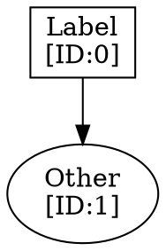

# Wavefront PyQt - Visual Guide

## Application Interface

Since this is a headless environment, here's a textual description of the application interface:

```
┌─────────────────────────────────────────────────────────────────────────┐
│ wavefront - Dataflow Token Visualizer                                    │
├─────────────────────────────────────────────────────────────────────────┤
│                                                                           │
│  ┌─── File Selection ─────────────────────────────────────────────────┐ │
│  │                                                                     │ │
│  │  [Load DOT Graph]  ✓ Loaded: example_dot.dot                       │ │
│  │  [Load Fire Log]   ✓ Loaded: fire.log (607 entries)                │ │
│  │                                                                     │ │
│  └─────────────────────────────────────────────────────────────────────┘ │
│                                                                           │
│  Total Cycles: 130                    Nodes in Graph: 58                 │
│                                                                           │
│  ┌──────────────────────────────────┬────────────────────────────────┐  │
│  │                                  │  Execution Log                 │  │
│  │                                  │  ─────────────────             │  │
│  │        Graph Visualization       │                                │  │
│  │        (Graphviz SVG)            │  Cycle 5                       │  │
│  │                                  │  ──────                        │  │
│  │     [Dataflow graph with         │  carry_3 (ID:23)               │  │
│  │      nodes and edges,            │  INIT->BLOCK 0                 │  │
│  │      rendered from DOT]          │                                │  │
│  │                                  │  pconst_arg5 (ID:21)           │  │
│  │  • Zoom/Pan with mouse           │  4                             │  │
│  │  • Click nodes for details       │                                │  │
│  │                                  │  pconst_arg3 (ID:20)           │  │
│  │                                  │  168                           │  │
│  │                                  │                                │  │
│  │                                  │  c0_1 (ID:18)                  │  │
│  │                                  │  0                             │  │
│  │                                  │                                │  │
│  │                                  │  stream (ID:4)                 │  │
│  │                                  │  false 0 4 1 2                 │  │
│  └──────────────────────────────────┴────────────────────────────────┘  │
│                                                                           │
│  [Zoom In (+)]  [Reset View]  [Zoom Out (-)]                             │
│                                                                           │
│  ┌─── Playback Controls ──────────────────────────────────────────────┐ │
│  │                                                                     │ │
│  │  Cycle: 5        Instructions: 14                                  │ │
│  │                                                                     │ │
│  │  [Play] [Pause] [Previous] [Next] [Reset]   Speed: [═══●══] 5x    │ │
│  │                                                                     │ │
│  └─────────────────────────────────────────────────────────────────────┘ │
│                                                                           │
└─────────────────────────────────────────────────────────────────────────┘
```

## UI Components

### Top Section - File Selection
- **Load DOT Graph Button**: Opens file dialog for .dot files
- **DOT Status Label**: Shows loaded file name with ✓ or error
- **Load Fire Log Button**: Opens file dialog for .log/.txt files  
- **Log Status Label**: Shows loaded file with entry count

### Statistics Bar
- **Total Cycles**: Displays maximum cycle number from fire log
- **Nodes in Graph**: Shows number of nodes extracted from DOT

### Main Area - Splitter (Resizable)

#### Left Panel - Graph Visualization
- **QGraphicsView**: High-performance graphics display
- **SVG Rendering**: Graphviz-generated graph visualization
- **Mouse Interactions**:
  - Wheel: Zoom in/out
  - Click+Drag: Pan around graph
  - Hover: (Future: tooltip information)

#### Right Panel - Execution Log
- **QTextEdit**: HTML-formatted log display
- Shows current cycle number as heading
- Lists all instructions executed in current cycle
- Format: `instruction_name (ID:X) args...`
- Auto-scrolls to show latest entries

### Zoom Controls Row
- **Zoom In (+)**: Zoom in 15%
- **Reset View**: Reset to 100% zoom and center
- **Zoom Out (-)**: Zoom out 15%

### Bottom Section - Playback Controls

#### Information Display
- **Cycle Label**: Shows current cycle number (0 to max)
- **Instructions Label**: Shows count of instructions in current cycle

#### Control Buttons
- **Play**: Start automatic cycle progression
- **Pause**: Stop automatic playback
- **Previous**: Step back one cycle
- **Next**: Step forward one cycle
- **Reset**: Return to cycle 0

#### Speed Control
- **Speed Slider**: Horizontal slider (1-10)
- **Speed Label**: Shows "Nx" (e.g., "5x")
- Controls playback interval: 1000ms / speed

## Color Scheme

The application uses Qt's Fusion style for a modern, cross-platform appearance:

- **Background**: White/Light gray
- **Widgets**: Native Qt styling
- **Graph**: Rendered colors from DOT file
  - Nodes: Various colors based on type
  - Edges: Black with arrows
  - Labels: Black text
- **Buttons**: Standard Qt button appearance
- **Text**: Black on white for readability

## Keyboard Shortcuts

```
Space      → Play/Pause animation
←          → Previous cycle
→          → Next cycle
Home       → Reset to cycle 0
End        → Jump to last cycle
```

## Graph Visualization Details

The DOT file defines:
- **Node shapes**: ellipse, box, parallelogram, hexagon
- **Node colors**: Different colors for different operation types
  - Constants: Yellow/cream (#F7F1E3)
  - Operations: Light gray (#E8E8E8)
  - Special ops: Green (#96CEB4), Purple (#B8B8D0)
- **Node labels**: Show operation name and ID
- **Edges**: Arrows showing data flow direction
- **Edge labels**: Port/argument information

Example node in DOT:
```dot
dataflow_constant_1 [
    label="%0 = 0\n[ID:0]",
    shape=ellipse,
    fillcolor="#F7F1E3",
    style="filled,bold"
];
```

## Animation Behavior

When playing:
1. Timer fires every (1000 / speed) milliseconds
2. Advances to next cycle
3. Updates cycle label and instruction count
4. Updates execution log with new instructions
5. (Future: Highlights active nodes in graph)

When at last cycle:
- Playback automatically pauses
- User can reset or manually navigate

## File Format Examples

### DOT Graph Format


### Fire Log Format
```
[1] (3) copy 58 58
[2] (19) c1_1 1
[2] (11) pconst_arg4 4
```

Format: `[cycle] (instruction_id) name args...`

## Responsive Design

The interface adapts to different window sizes:
- **Splitter**: User can resize graph vs log panels
- **Scroll bars**: Appear when content exceeds viewport
- **Buttons**: Fixed width, aligned properly
- **Labels**: Expand to fit content

## Accessibility

- All buttons have clear labels
- Keyboard shortcuts for all major actions
- Readable font sizes
- High contrast text
- Status messages for file operations

## Performance Characteristics

- **Startup**: < 1 second on modern hardware
- **Graph loading**: 1-3 seconds for typical graphs
- **Rendering**: Real-time with hardware acceleration
- **Animation**: Smooth 60 FPS (limited by timer interval)
- **Memory**: Efficient, scales with graph size
- **File I/O**: Fast Python I/O for text files

## Platform Differences

### Windows
- Native Windows file dialogs
- Windows-style buttons and widgets
- Uses system fonts

### macOS  
- Native macOS file dialogs
- macOS-style buttons and widgets
- Uses San Francisco font

### Linux
- Native Linux file dialogs (depends on desktop)
- GTK or Qt style
- Uses system fonts (typically DejaVu Sans)

## Future UI Enhancements

Potential improvements:
1. **Node highlighting**: Highlight active nodes during animation
2. **Edge highlighting**: Show data flow on edges
3. **Tooltips**: Show node details on hover
4. **Color coding**: Color-code active/inactive nodes
5. **Timeline**: Visual timeline scrubber for cycle navigation
6. **Export**: Screenshot/video export buttons
7. **Settings**: Preferences dialog for customization
8. **Multiple views**: Support multiple graph windows
9. **Search**: Find nodes/instructions by name
10. **Filters**: Filter log by instruction type

## Comparison with Web Version

### Web Version
- Browser-based, opens in tab
- Uses HTML/CSS/JavaScript
- D3.js for interactions
- CDN-loaded libraries
- Drag & drop file upload
- Modern web UI styling

### PyQt Version
- Native desktop application
- Python with Qt widgets
- Qt Graphics View framework
- Local dependencies only
- Native file dialogs
- Native OS styling

Both versions have equivalent functionality!
